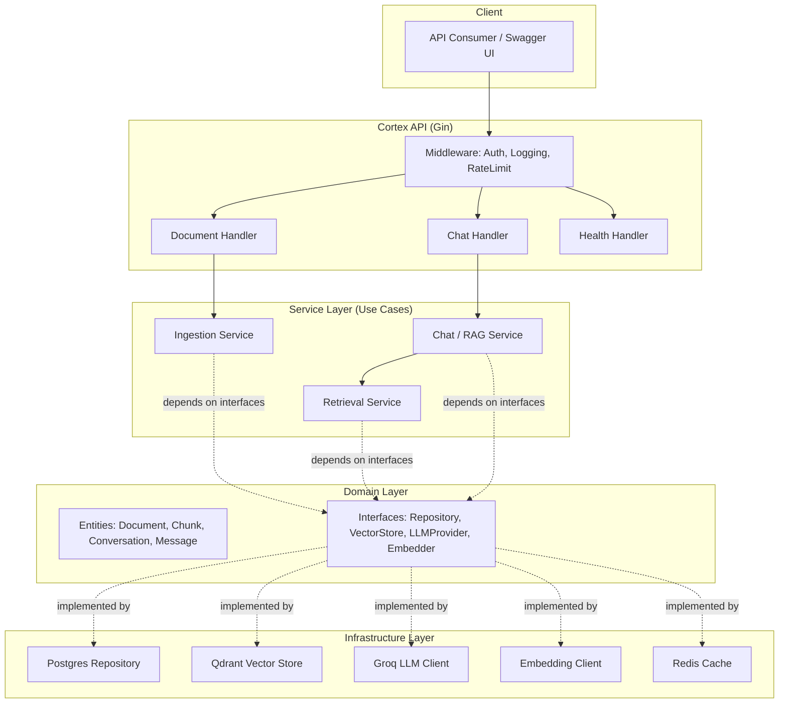

# Cortex AI — Enterprise Knowledge Assistant

> A production-grade Retrieval-Augmented Generation (RAG) platform built in Go, designed for organizations to upload internal knowledge sources and query them through natural language, grounded in their own documents with source citations.

[](https://go.dev/)
[](LICENSE)
[](.github/workflows)
[]()

---

## Status

This project is under active development and is being built incrementally, milestone by milestone, with an emphasis on production engineering practices over move-fast prototyping. See [Roadmap](#roadmap) for what's built vs. planned.

**Currently in progress:** Milestone 1 — Project Foundation & Infrastructure.

---

## Why This Project Exists

Most public RAG demos are notebooks: a script that chunks a PDF, embeds it, and prints an answer. Cortex AI is an attempt to build the version of that idea an actual engineering team would ship internally — with proper service boundaries, provider-agnostic LLM integration, observability, and a test suite, not just a working demo.

---

## Core Features

| Feature | Status |
|---|---|
| PDF / DOCX / TXT / Markdown upload | Planned |
| Intelligent document parsing & chunking | Planned |
| Embedding generation | Planned |
| Vector storage & semantic search | Planned |
| Retrieval-Augmented Generation (RAG) | Planned |
| Source citations | Planned |
| Conversation history (multi-turn) | Planned |
| Streaming responses | Planned |
| Multi-document querying | Planned |
| Provider-agnostic LLM layer (Groq → OpenAI/Anthropic/Gemini/Ollama) | Planned |
| Health checks, structured logging, config management | In progress |

Future architecture will extend to: AI agents, MCP (Model Context Protocol) tool integration, multi-agent workflows, hybrid search, reranking, evaluation pipelines, full observability, and multi-user auth/authorization.

---

## Tech Stack

| Layer | Technology |
|---|---|
| Language | Go |
| HTTP Framework | Gin |
| AI Orchestration | LangChain (Go) |
| LLM Inference | Groq API (provider-agnostic interface) |
| Vector Database | Qdrant |
| Relational Database | PostgreSQL |
| Caching | Redis |
| Containerization | Docker / Docker Compose |
| CI/CD | GitHub Actions |
| API Docs | OpenAPI / Swagger |
| Diagrams | Mermaid |

---

## Architecture

Cortex AI follows Clean Architecture principles: business logic in the **service** layer depends only on **interfaces** defined in the **domain** layer, never directly on infrastructure. This means the LLM provider, vector store, and database can each be swapped without touching business logic.



Full architecture notes and diagrams live in [`docs/architecture`](docs/architecture).

---

## Project Structure

```
cortex-ai/
├── cmd/
│   └── api/                 # application entrypoint
├── internal/
│   ├── config/               # env loading & validation
│   ├── domain/                # entities + interfaces (ports)
│   ├── service/               # use cases: ingestion, retrieval, chat
│   ├── transport/http/        # handlers, middleware, routing
│   ├── repository/postgres/  # Postgres implementation
│   ├── vectorstore/qdrant/    # Qdrant implementation
│   ├── llm/groq/               # Groq LLM implementation
│   ├── embedding/             # embedding client
│   ├── cache/redis/           # Redis implementation
│   └── logger/                # structured logging
├── migrations/                 # SQL migrations
├── deployments/docker/         # Dockerfiles, compose configs
├── docs/
│   ├── architecture/           # Mermaid diagrams, design docs
│   └── api/                    # OpenAPI spec
├── .github/workflows/          # CI/CD pipelines
├── docker-compose.yml
└── go.mod
```

---

## Getting Started

> Setup instructions will be filled in as infrastructure is wired up (Milestone 1). Once available, this section will cover local dev with Docker Compose, required environment variables, and how to run the service.

```bash
# Placeholder — not yet functional
git clone https://github.com/<your-username>/cortex-ai.git
cd cortex-ai
cp .env.example .env
docker compose up --build
```

---

## Roadmap

- [x] Define high-level architecture and folder structure
- [ ] Milestone 1 — Project foundation: config, logging, health endpoint, Docker, CI
- [ ] Milestone 2 — Domain entities & Postgres persistence
- [ ] Milestone 3 — Document ingestion (upload, parsing, chunking)
- [ ] Milestone 4 — Embeddings & Qdrant vector store
- [ ] Milestone 5 — Semantic retrieval
- [ ] Milestone 6 — LLM provider abstraction + Groq integration
- [ ] Milestone 7 — RAG chat endpoint with source citations & streaming
- [ ] Milestone 8 — Conversation history (Postgres + Redis)
- [ ] Milestone 9 — Auth, rate limiting, observability, eval pipeline

---

## Design Principles

- **Clean Architecture** — domain logic has zero knowledge of infrastructure.
- **Provider independence** — no business logic imports Groq, Qdrant, or Postgres SDKs directly; everything goes through an interface.
- **Idiomatic Go** — explicit error handling, context propagation, no hidden global state.
- **Extensibility over premature complexity** — infrastructure is added one dependency at a time, only when a milestone needs it.

---

## Contributing

This is currently a personal portfolio project built milestone-by-milestone. Issues and suggestions are welcome once the core pipeline (Milestones 1–7) is complete.

---

## License

[MIT](LICENSE)
